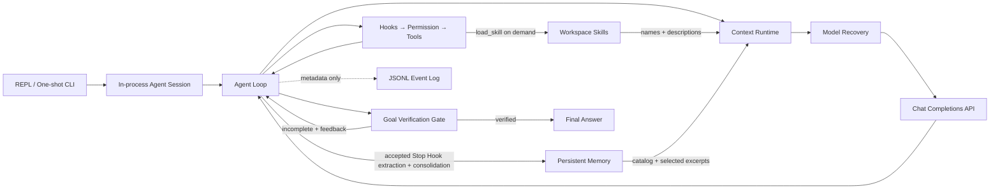

# TinyHarness

TinyHarness 是一个面向 DeepSeek Chat Completions API 的轻量 Coding Agent Harness。它用一条显式、可测试的 Python 控制链，把模型输出变成受约束的工具执行，并围绕 **Context、Execution、Verification、Observability** 四条控制面研究 Harness Reliability。

它不是完整 IDE，也不是通用 Agent Framework。项目关注的是一个更小的问题：当模型会调用工具、修改代码并自主结束时，Harness 如何避免静默错误、恢复可恢复故障，并为最终结果留下可验证证据。



## What is implemented

| 控制面 | 核心机制 |
|---|---|
| **Execution** | 多 Tool Calls、统一 Registry、workspace 文件边界、ALLOW/DENY/ASK、Pre/Post Tool Hooks、Todo、单层同步 Subagent |
| **Context** | 协议校验、字符预算、大 Tool Result 落盘、历史裁剪、旧结果替换、LLM Summary、reactive compaction |
| **Skills** | workspace 单源目录、frontmatter 元数据目录、按需 `load_skill`、不可信正文边界 |
| **Memory** | 显式启用、Markdown + frontmatter、LLM side-query + 关键词降级、Stop Hook 提取、阈值整理 |
| **Verification** | 非法模型响应执行前拒绝、独立 Goal Evaluator、workspace 外 hidden grader、安全不变量 |
| **Observability** | run/turn/attempt/tool 生命周期 JSONL、父子 Agent 关联、retry/continuation 指标、正文最小化 |

模型接入通过 `api_key`、`base_url` 和 `model` 注入。DeepSeek 是默认服务，但 Runtime 依赖的是兼容 Chat Completions function calling 的 Provider，而不是厂商专用 Agent SDK；`reasoning_content` 只作为可选兼容字段保留。

## Reliability results

正式评测使用 `deepseek-v4-flash`，包含 5 个 coding fixtures、两个 profile、每组重复 3 次，共 30 个真实 Agent run。正确性由 Agent workspace 外的 deterministic hidden tests 判定，不使用 LLM-as-judge。

| Profile | Verified | False success | Explicit failure | Avg model attempts | Avg turns |
|---|---:|---:|---:|---:|---:|
| `basic_ablation` | 15/15 | 0 | 0 | 6.9 | 6.9 |
| `reliable` | 15/15 | 0 | 0 | 8.2 | 7.2 |

受控故障与安全不变量：

- Reliable 对 transient provider failure、context rejection、premature final answer **3/3 恢复**；
- Basic 在相同注入下分别明确失败、明确失败和产生 false success；
- Permission deny 无文件副作用、非法 `length + write_file` 无工具副作用，**2/2 通过**；
- 30/30 hidden graders 的退出码均为 0；267 项本地测试中 261 项通过，6 项因当前 Windows 用户缺少符号链接权限而跳过。

这组小型真实任务中两个 profile 都是 15/15，因此它**不能证明** Reliable 降低了真实 coding task 的失败率。它证明的是指定恢复路径和安全不变量确实生效，并量化了本次样本中平均 `+1.3` 次模型调用（约 18.8%）的可靠性开销。完整实验口径见 [evals/README.md](evals/README.md)。

## Quick start

要求 Python 3.10+。从源码安装：

```powershell
git clone https://github.com/729194587/tiny_harness.git
cd tiny_harness

python -m venv .venv
.\.venv\Scripts\Activate.ps1
python -m pip install -e .
```

API Key 只通过进程环境提供，不要写入源码：

```powershell
$env:TINYHARNESS_API_KEY = "你的 API Key"
```

进入要操作的项目目录，直接启动交互会话：

```powershell
cd D:\path\to\your-project
python -m tiny_harness
```

同一进程内的每次输入会复用此前的 user、assistant 和 tool history，因此后续问题可以引用前面完成的工作。输入 `/clear` 清空对话但保留 workspace 文件；输入 `q`、`quit`、`exit` 或 `/exit` 退出。

```text
你> 检查失败的测试并说明原因
助手> ...

你> 修复它，然后重新运行测试
助手> ...

你> exit
```

脚本或 CI 仍可传入 task，执行一次性任务：

```powershell
python -m tiny_harness `
  "检查项目并修复失败的单元测试，修改后重新运行测试" `
  --workspace .
```

启用 Context Runtime、外部事件日志和 Goal Verification：

```powershell
New-Item -ItemType Directory -Force D:\tinyharness-logs

python -m tiny_harness `
  "修复 palindrome.py，使全部测试通过" `
  --goal "实现正确，并且执行记录中有测试退出码为 0 的证据" `
  --workspace . `
  --max-context-chars 100000 `
  --event-log D:\tinyharness-logs\run.jsonl
```

`bash` 使用输入相关的权限策略：明确识别为 workspace 相对路径查询的命令（例如 `rg --files`、`dir /s /b *.py`、`git status`）直接 ALLOW；写重定向、解释器执行、修改命令、动态或外部路径等不明确操作使用 ASK。ASK 时 CLI 会显示参数并等待 `y` 或 `yes`，其他输入、EOF 或权限组件异常都按拒绝处理。

## Runtime flow

一次主模型响应可能包含多个 tool calls。TinyHarness 保留原始顺序并逐个执行，每个结果都以独立 tool message 回填：

```text
Model response
  → validate finish reason / tool-call contract
  → PreToolUse hooks
  → Permission gate
  → Tool registry and handler
  → PostToolUse hooks
  → ToolResult
  → next model turn
```

只有被接受的模型响应才会写入 assistant history。`length`、`content_filter`、空 tool batch 或 finish reason/tool calls 相互矛盾的响应，会在提交 history 和产生工具副作用前失败。

暂时性 Provider 错误使用有界指数退避；API 拒绝 context 时最多执行一次 reactive compaction。每个物理请求都记录独立的 `purpose / turn / attempt`，retry 不会重置逻辑 turn。

模型返回最终文本后，可选 Goal Evaluator 根据 completion condition 和有界执行证据独立判断：证据不足则丢弃候选答案并继续原 Agent Loop，验证通过才返回最终答案。Goal 目前只支持 one-shot CLI，或 fresh `AgentSession` 的第一次 `submit()`；多轮会话不复用旧证据验证新 Goal。

## Minimal Skills

TinyHarness 只发现当前 workspace 中直接位于 `skills/<directory>/SKILL.md` 的 Skill。启动一次 run 时只读取有界 YAML frontmatter，把 `name` 和 `description` 作为目录放进第一次模型请求；完整正文不会自动进入上下文。只有存在有效 Skill 时才暴露 `load_skill` 工具，模型按精确名称调用后，完整 `SKILL.md` 才作为普通 Tool Result 进入 messages：

```text
create_run_context
  → discover_skills             # bounded frontmatter only
  → catalog system marker       # names + descriptions
  → model calls load_skill
  → Hooks → Permission → load
  → untrusted ToolResult
  → next model turn
```

最小目录和文档格式：

```text
workspace/
└─ skills/
   └─ review/
      └─ SKILL.md
```

```markdown
---
name: review
description: Review code changes for correctness and missing tests
---

# Review workflow

Inspect the changed files, run focused tests, and report concrete findings.
```

当前只支持 `name` 和 `description`，不实现多来源、legacy commands、`allowed-tools`、forked Skill、Skill 级 Hooks 或 MCP Skill。重复 `name` 会使该名称的所有候选整体失效，不使用目录排序选择胜者。目录最多注册 100 项，目录文本最多 8,000 字符，单个完整文档最多 30,000 字符；超限会省略目录尾部或明确拒绝加载，不返回截断正文。连续会话在每次 `submit()` 时重新发现目录，Subagent 也从共享 workspace 建立自己的目录，但父子 history 保持隔离。

Skill 文件属于不可信 workspace 内容：它不能覆盖 system/user 指令、授予 Permission、绕过 Hooks、扩大 workspace 边界或自行授权工具调用。`load_skill` 仍经过统一 Permission、Pre/Post Tool Hooks 和 Event Log，加载后的大结果也继续受 Context Budget 与落盘策略约束。可直接试用 [examples/skills_demo](examples/skills_demo) 中的最小 workspace。

## Minimal Memory

Memory 是跨 Context Compact、跨进程会话保留的长期知识，不是当前任务的 Plan、Todo 或 Session Memory。它默认关闭，因为启用后会增加无工具模型调用并产生持久写入；可用 `--memory` 明确启用。存储固定在 workspace 内的 Harness 私有目录：

```text
.tinyharness/memory/
├─ MEMORY.md               # 派生索引
├─ user-tabs.md
├─ project-auth.md
└─ archive/                # consolidation 成功前的完整旧快照
```

每个文件使用 Markdown + YAML frontmatter，类型只允许 `user`、`feedback`、`project` 和 `reference`：

```markdown
---
name: user-tabs
description: User prefers tabs for indentation
type: user
---

Use tabs when writing or editing source files.
```

一次启用 Memory 的 run 使用以下函数流水线：

```text
discover_memories                 # 最多 200 项，按 mtime 降序，只读 frontmatter
  → catalog marker                # name / description / type，不含正文
  → tool-free LLM side-query      # 最多选择 5 个精确 filename
     └─ invalid/error/budget → conservative keyword fallback
  → bounded relevant excerpts     # 每文件最多 200 行 / 4096 bytes
  → untrusted user-role marker
  → unchanged Agent Loop
  → Goal Stop Gate allows final answer
  → Memory Stop Hook extraction   # 严格 JSON、无工具、最多 5 项
  → atomic files + MEMORY.md rebuild
  → if new write and count >= 10
     → complete snapshot           # 正文不截断；modified_at 给模型
     → tool-free consolidation     # 完整 replacement set，after <= before
     → fingerprint recheck
     → staging
     → commit-time recheck
     → archive + replace + MEMORY.md rebuild
```

选择请求只包含最近用户文本和 Memory 元数据，不包含正文；它复用现有 Provider、Recovery 和 `purpose=memory_selection` Event。相关正文以具名 user marker 注入，避免把历史文件提升为可信 system 指令，并继续受 Context Budget 约束。提取发生在最终候选被 Goal Gate 接受之后，使用 `purpose=memory_extraction` 的无工具请求；无有效新信息时返回空数组。普通 Provider、解析或写入失败采用 fail-open，只记录不含正文的失败元数据，不阻止主任务返回；Event Log 自身失败仍然上抛。

Memory 名称和文件路径只能使用有界逻辑标识；符号链接和 workspace 逃逸会被拒绝，重复名称整体失效，提取不会覆盖已有文件。写入属于显式启用后的 Harness 内部状态维护，只能触及 `.tinyharness/memory/`，不会执行命令或绕过现有 Tool Permission/Hooks。Subagent 可以选择并读取同一 workspace 的 Memory，但不执行提取，避免把 delegated prompt 或子 Agent 推断写入长期状态。

Consolidation 是同步、tool-free 的最小实现。只有提取实际写入新 Memory、当前有效文件达到 10 个且 discovery 无 issue 时才以 `purpose=memory_consolidation` 请求模型；模型获得完整正文和可读的 `modified_at`，但 `modified_ns + content hash` 只留在 Harness 中构造指纹。整理结果不强求减少条数，只要求非空且 `after_count <= before_count`，因此 `10 → 10` 是合法更新。模型输出先写入不参与 discovery 的唯一 staging 目录；Harness 在模型返回后和 commit 前各检查一次快照指纹，随后把旧 active 文件移入唯一 archive，再激活 replacement set。激活失败会尝试回滚，普通 consolidation 失败仍然 fail-open，不阻止主回答；四类 consolidation Event 只记录计数、结果和错误类型，不记录 Memory 正文。

这里使用的是 optimistic concurrency，不是文件锁；最终检查与文件移动之间仍存在很小的跨进程竞争窗口。Minimal 版也刻意没有 24 小时、session 数量或后台 Dream 门控，所以达到 10 个以后，每次成功写入新 Memory 都可能再次触发 consolidation。Archive 和 staging 永远不参与 Memory discovery，archive 暂不自动清理。当前仍不实现 Dream、Session Memory、异步 prefetch、embedding、Team Memory、文件锁或 forked extraction agent。

```powershell
python -m tiny_harness `
  "Remember that I prefer tabs, then inspect this project" `
  --workspace . `
  --memory
```

## Tools and policies

| Tool | 行为 | 默认权限 |
|---|---|---|
| `read_file` | 读取 workspace 内 UTF-8 文件 | ALLOW |
| `write_file` | 写入文件并创建 workspace 内父目录 | ALLOW |
| `edit_file` | 仅在 `old_text` 唯一时执行精确替换 | ALLOW |
| `list_files` | 稳定排序并列出直接子项 | ALLOW |
| `bash` | 以 workspace 为 `cwd` 执行 shell，返回退出码 | 明确只读时 ALLOW，否则 ASK |
| `todo_write` | 原子更新当前 run 的内存 Todo | ALLOW |
| `task` | 运行 fresh-context 子 Agent，只返回最终文本 | ALLOW |
| `load_skill` | 按目录中的精确名称加载完整 `SKILL.md` | ALLOW |
| `compact` | 在完整工具批次后请求历史摘要 | ALLOW |

文件工具拒绝 `..` 穿越、workspace 外绝对路径和可解析的符号链接逃逸。`edit_file` 在 anchor 出现 0 次或多次时明确报错，避免静默修改错误位置。工具异常、未知工具和非法 JSON 参数都转换为关联原 call ID 的 `ToolResult`。

## Context runtime

Context Runtime 默认使用 100,000 字符预算。连续会话的历史增长后，每次模型调用前依次执行：

```text
1. tool_result_budget  大结果保存为 workspace artifact
2. snip_compact       归档并裁剪过长旧历史
3. micro_compact      用占位符替换旧 ToolResult
4. compact_history    最后才调用模型总结旧历史
```

当前 user request、run-scoped control marker 和最新完整 tool-call batch 被优先保留；一次 assistant 响应中的 tool calls 与对应 results 不会拆开。旧的完整会话轮次会优先整体移除，压缩后仍无法满足预算时，会在主 API 调用前明确失败。这里的字符预算是确定性本地近似，不等于精确 token 数。可用 `--no-context-compaction` 显式关闭。

## Configuration

| 配置 | 默认值 | 说明 |
|---|---|---|
| `TINYHARNESS_API_KEY` | 无 | 必需的 API Key |
| `TINYHARNESS_MODEL` | `deepseek-v4-flash` | Chat Completions 模型 ID |
| `TINYHARNESS_BASE_URL` | `https://api.deepseek.com` | 模型服务地址 |
| `--workspace` | 当前目录 | Agent 文件工具作用域 |
| `--max-turns` | `20` | 主 Agent 最大逻辑轮次 |
| `--max-model-retries` | `2` | 每个逻辑请求的暂时性重试次数 |
| `--subagent-max-turns` | `10` | 每个同步子 Agent 的最大轮次 |
| `--max-context-chars` | `100000` | 模型上下文的字符预算 |
| `--no-context-compaction` | 不启用 | 关闭上下文预算与压缩 |
| `--event-log` | 不启用 | 追加写入 JSONL 生命周期日志 |
| `--goal` | 不启用 | 最终答案的 completion condition |
| `--max-goal-retries` | `3` | Goal 被拒绝后的自动 continuation 次数 |
| `--memory` | 不启用 | 启用 workspace 长期 Memory 选择与 Stop Hook 提取 |

项目当前不自动读取 `.env`。

## Evaluation

离线故障注入和安全不变量不需要 API Key：

```powershell
python -m evals.run --suite offline
```

完整评测（30 个真实 run，加上不消耗 API 的受控故障与安全不变量）：

```powershell
python -m evals.run `
  --suite all `
  --profile both `
  --repetitions 3
```

每次 run 使用全新的 `workspace/`，hidden grader 和 `events.jsonl` 位于其外部。报告分成 Real Coding、Controlled Failure Recovery、Safety Invariants 三部分；原始运行目录写入被 Git 忽略的 `evals/results/`。

## Tests

```powershell
python -m unittest discover -s tests -v
```

当前本地基线：

- 267 tests executed；
- 261 passed；
- 6 skipped：当前 Windows 用户无法创建测试所需的符号链接。

## Trust boundaries

- 文件工具有 workspace 路径边界；`bash` 的只读识别只是保守的审批 UX 规则，它仍只有 `cwd` 约束，**不是 OS sandbox**。
- Event Log 是 observability trace，不是防篡改 audit log；建议写到 Agent workspace 外。
- `.tinyharness/context/` 中的 artifact 用于恢复信息，不是可信证据。
- Skill 的目录元数据和完整正文都是不可信 workspace 内容；`load_skill` 不产生额外权限。
- Memory 元数据和正文是不可信历史数据；当前请求优先，Memory 不能充当授权、Plan、Todo 或任务来源。
- Memory archive 保留 consolidation 前的旧正文且暂不自动清理，应按持久敏感数据对待。
- Goal Evaluator 是停止门，不是形式化证明；workspace/process 条件仍需要实际 tool results。
- Subagent 共享 workspace、Provider、Permission 和 Hooks，但只有一层且顺序执行。
- 连续会话只存在于当前 CLI 进程；退出后不会持久化或 Resume。
- 当前没有 Session Resume、MCP、Dream、Session/Team Memory、并行 Agent、精确 token accounting 或 fallback model；Memory consolidation 没有时间/session 门控、文件锁或 archive 自动清理。

这些是 TinyHarness v1 的明确范围，而不是已经实现但未启用的功能。

## Project layout

```text
tiny_harness/
├─ agent/          # messages, in-process session and explicit Agent Loop
├─ models/         # Provider contract and Chat Completions adapter
├─ tools/          # filesystem, shell, skill, todo, task, compact and registry
└─ runtime/        # permission, hooks, skills, memory, context, recovery, goal and events
evals/             # fixtures, hidden graders, fault scenarios and reports
examples/          # Python API and minimal Skill workspace examples
tests/             # deterministic unit and integration tests
```

## Design references

TinyHarness 选择性参考并重新实现了 `learn-claude-code` 的核心控制流：

- `s01_agent_loop` / `s02_tool_use`
- `s03_permission` / `s04_hooks` / `s05_todo_write`
- `s06_subagent` / `s07_skills` / `s08_context_compact` / `s09_memory`
- `s15_integrated_harness` 的 bounded retry 思路
- `s17_goal_loop` 的独立 Evaluator Stop Gate

metadata Event Log、初版 Context Guard 和 Reliability Eval 是 TinyHarness 自己的可靠性扩展。项目没有直接复制 integrated harness，也没有移植 Claude Code 产品源码；CC 细节只作为范围与取舍的对照。
