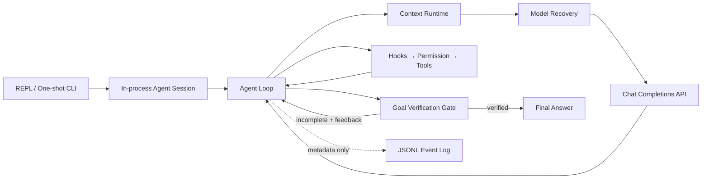

# TinyHarness

TinyHarness 是一个面向 DeepSeek Chat Completions API 的轻量 Coding Agent Harness。它用一条显式、可测试的 Python 控制链，把模型输出变成受约束的工具执行，并围绕 **Context、Execution、Verification、Observability** 四条控制面研究 Harness Reliability。

它不是完整 IDE，也不是通用 Agent Framework。项目关注的是一个更小的问题：当模型会调用工具、修改代码并自主结束时，Harness 如何避免静默错误、恢复可恢复故障，并为最终结果留下可验证证据。



## What is implemented

| 控制面 | 核心机制 |
|---|---|
| **Execution** | 多 Tool Calls、统一 Registry、workspace 文件边界、ALLOW/DENY/ASK、Pre/Post Tool Hooks、Todo、单层同步 Subagent |
| **Context** | 协议校验、字符预算、大 Tool Result 落盘、历史裁剪、旧结果替换、LLM Summary、reactive compaction |
| **Verification** | 非法模型响应执行前拒绝、独立 Goal Evaluator、workspace 外 hidden grader、安全不变量 |
| **Observability** | run/turn/attempt/tool 生命周期 JSONL、父子 Agent 关联、retry/continuation 指标、正文最小化 |

模型接入通过 `api_key`、`base_url` 和 `model` 注入。DeepSeek 是默认服务，但 Runtime 依赖的是兼容 Chat Completions function calling 的 Provider，而不是厂商专用 Agent SDK；`reasoning_content` 只作为可选兼容字段保留。

## Reliability results

正式评测使用 `deepseek-v4-flash`，包含 5 个 coding fixtures、两个 profile、每组重复 3 次，共 30 个真实 Agent run。正确性由 Agent workspace 外的 deterministic hidden tests 判定，不使用 LLM-as-judge。

| Profile | Verified | False success | Explicit failure | Avg model attempts | Avg turns |
|---|---:|---:|---:|---:|---:|
| `basic_ablation` | 15/15 | 0 | 0 | 6.9 | 6.9 |
| `reliable` | 15/15 | 0 | 0 | 8.2 | 7.2 |

受控故障与安全不变量：

- Reliable 对 transient provider failure、context rejection、premature final answer **3/3 恢复**；
- Basic 在相同注入下分别明确失败、明确失败和产生 false success；
- Permission deny 无文件副作用、非法 `length + write_file` 无工具副作用，**2/2 通过**；
- 30/30 hidden graders 的退出码均为 0；201 项本地测试中 198 项通过，3 项因当前 Windows 用户缺少符号链接权限而跳过。

这组小型真实任务中两个 profile 都是 15/15，因此它**不能证明** Reliable 降低了真实 coding task 的失败率。它证明的是指定恢复路径和安全不变量确实生效，并量化了本次样本中平均 `+1.3` 次模型调用（约 18.8%）的可靠性开销。完整实验口径见 [evals/README.md](evals/README.md)。

## Quick start

要求 Python 3.10+。从源码安装：

```powershell
git clone https://github.com/729194587/tiny_harness.git
cd tiny_harness

python -m venv .venv
.\.venv\Scripts\Activate.ps1
python -m pip install -e .
```

API Key 只通过进程环境提供，不要写入源码：

```powershell
$env:TINYHARNESS_API_KEY = "你的 API Key"
```

进入要操作的项目目录，直接启动交互会话：

```powershell
cd D:\path\to\your-project
python -m tiny_harness
```

同一进程内的每次输入会复用此前的 user、assistant 和 tool history，因此后续问题可以引用前面完成的工作。输入 `/clear` 清空对话但保留 workspace 文件；输入 `q`、`quit`、`exit` 或 `/exit` 退出。

```text
你> 检查失败的测试并说明原因
助手> ...

你> 修复它，然后重新运行测试
助手> ...

你> exit
```

脚本或 CI 仍可传入 task，执行一次性任务：

```powershell
python -m tiny_harness `
  "检查项目并修复失败的单元测试，修改后重新运行测试" `
  --workspace .
```

启用 Context Runtime、外部事件日志和 Goal Verification：

```powershell
New-Item -ItemType Directory -Force D:\tinyharness-logs

python -m tiny_harness `
  "修复 palindrome.py，使全部测试通过" `
  --goal "实现正确，并且执行记录中有测试退出码为 0 的证据" `
  --workspace . `
  --max-context-chars 100000 `
  --event-log D:\tinyharness-logs\run.jsonl
```

`bash` 使用输入相关的权限策略：明确识别为 workspace 相对路径查询的命令（例如 `rg --files`、`dir /s /b *.py`、`git status`）直接 ALLOW；写重定向、解释器执行、修改命令、动态或外部路径等不明确操作使用 ASK。ASK 时 CLI 会显示参数并等待 `y` 或 `yes`，其他输入、EOF 或权限组件异常都按拒绝处理。

## Runtime flow

一次主模型响应可能包含多个 tool calls。TinyHarness 保留原始顺序并逐个执行，每个结果都以独立 tool message 回填：

```text
Model response
  → validate finish reason / tool-call contract
  → PreToolUse hooks
  → Permission gate
  → Tool registry and handler
  → PostToolUse hooks
  → ToolResult
  → next model turn
```

只有被接受的模型响应才会写入 assistant history。`length`、`content_filter`、空 tool batch 或 finish reason/tool calls 相互矛盾的响应，会在提交 history 和产生工具副作用前失败。

暂时性 Provider 错误使用有界指数退避；API 拒绝 context 时最多执行一次 reactive compaction。每个物理请求都记录独立的 `purpose / turn / attempt`，retry 不会重置逻辑 turn。

模型返回最终文本后，可选 Goal Evaluator 根据 completion condition 和有界执行证据独立判断：证据不足则丢弃候选答案并继续原 Agent Loop，验证通过才返回最终答案。Goal 目前只支持 one-shot CLI，或 fresh `AgentSession` 的第一次 `submit()`；多轮会话不复用旧证据验证新 Goal。

## Tools and policies

| Tool | 行为 | 默认权限 |
|---|---|---|
| `read_file` | 读取 workspace 内 UTF-8 文件 | ALLOW |
| `write_file` | 写入文件并创建 workspace 内父目录 | ALLOW |
| `edit_file` | 仅在 `old_text` 唯一时执行精确替换 | ALLOW |
| `list_files` | 稳定排序并列出直接子项 | ALLOW |
| `bash` | 以 workspace 为 `cwd` 执行 shell，返回退出码 | 明确只读时 ALLOW，否则 ASK |
| `todo_write` | 原子更新当前 run 的内存 Todo | ALLOW |
| `task` | 运行 fresh-context 子 Agent，只返回最终文本 | ALLOW |
| `compact` | 在完整工具批次后请求历史摘要 | ALLOW |

文件工具拒绝 `..` 穿越、workspace 外绝对路径和可解析的符号链接逃逸。`edit_file` 在 anchor 出现 0 次或多次时明确报错，避免静默修改错误位置。工具异常、未知工具和非法 JSON 参数都转换为关联原 call ID 的 `ToolResult`。

## Context runtime

Context Runtime 默认使用 100,000 字符预算。连续会话的历史增长后，每次模型调用前依次执行：

```text
1. tool_result_budget  大结果保存为 workspace artifact
2. snip_compact       归档并裁剪过长旧历史
3. micro_compact      用占位符替换旧 ToolResult
4. compact_history    最后才调用模型总结旧历史
```

当前 user request、run-scoped control marker 和最新完整 tool-call batch 被优先保留；一次 assistant 响应中的 tool calls 与对应 results 不会拆开。旧的完整会话轮次会优先整体移除，压缩后仍无法满足预算时，会在主 API 调用前明确失败。这里的字符预算是确定性本地近似，不等于精确 token 数。可用 `--no-context-compaction` 显式关闭。

## Configuration

| 配置 | 默认值 | 说明 |
|---|---|---|
| `TINYHARNESS_API_KEY` | 无 | 必需的 API Key |
| `TINYHARNESS_MODEL` | `deepseek-v4-flash` | Chat Completions 模型 ID |
| `TINYHARNESS_BASE_URL` | `https://api.deepseek.com` | 模型服务地址 |
| `--workspace` | 当前目录 | Agent 文件工具作用域 |
| `--max-turns` | `20` | 主 Agent 最大逻辑轮次 |
| `--max-model-retries` | `2` | 每个逻辑请求的暂时性重试次数 |
| `--subagent-max-turns` | `10` | 每个同步子 Agent 的最大轮次 |
| `--max-context-chars` | `100000` | 模型上下文的字符预算 |
| `--no-context-compaction` | 不启用 | 关闭上下文预算与压缩 |
| `--event-log` | 不启用 | 追加写入 JSONL 生命周期日志 |
| `--goal` | 不启用 | 最终答案的 completion condition |
| `--max-goal-retries` | `3` | Goal 被拒绝后的自动 continuation 次数 |

项目当前不自动读取 `.env`。

## Evaluation

离线故障注入和安全不变量不需要 API Key：

```powershell
python -m evals.run --suite offline
```

完整评测（30 个真实 run，加上不消耗 API 的受控故障与安全不变量）：

```powershell
python -m evals.run `
  --suite all `
  --profile both `
  --repetitions 3
```

每次 run 使用全新的 `workspace/`，hidden grader 和 `events.jsonl` 位于其外部。报告分成 Real Coding、Controlled Failure Recovery、Safety Invariants 三部分；原始运行目录写入被 Git 忽略的 `evals/results/`。

## Tests

```powershell
python -m unittest discover -s tests -v
```

当前本地基线：

- 201 tests executed；
- 198 passed；
- 3 skipped：当前 Windows 用户无法创建测试所需的符号链接。

## Trust boundaries

- 文件工具有 workspace 路径边界；`bash` 的只读识别只是保守的审批 UX 规则，它仍只有 `cwd` 约束，**不是 OS sandbox**。
- Event Log 是 observability trace，不是防篡改 audit log；建议写到 Agent workspace 外。
- `.tinyharness/context/` 中的 artifact 用于恢复信息，不是可信证据。
- Goal Evaluator 是停止门，不是形式化证明；workspace/process 条件仍需要实际 tool results。
- Subagent 共享 workspace、Provider、Permission 和 Hooks，但只有一层且顺序执行。
- 连续会话只存在于当前 CLI 进程；退出后不会持久化或 Resume。
- 当前没有 Session Resume、MCP、Memory、并行 Agent、精确 token accounting 或 fallback model。

这些是 TinyHarness v1 的明确范围，而不是已经实现但未启用的功能。

## Project layout

```text
tiny_harness/
├─ agent/          # messages, in-process session and explicit Agent Loop
├─ models/         # Provider contract and Chat Completions adapter
├─ tools/          # filesystem, shell, todo, task, compact and registry
└─ runtime/        # permission, hooks, context, recovery, goal and events
evals/             # fixtures, hidden graders, fault scenarios and reports
examples/          # Python API examples
tests/             # deterministic unit and integration tests
```

## Design references

TinyHarness 选择性参考并重新实现了 `learn-claude-code` 的核心控制流：

- `s01_agent_loop` / `s02_tool_use`
- `s03_permission` / `s04_hooks` / `s05_todo_write`
- `s06_subagent` / `s08_context_compact`
- `s15_integrated_harness` 的 bounded retry 思路
- `s17_goal_loop` 的独立 Evaluator Stop Gate

metadata Event Log、初版 Context Guard 和 Reliability Eval 是 TinyHarness 自己的可靠性扩展。项目没有直接复制 integrated harness，也没有查看或移植 Claude Code 产品源码。
